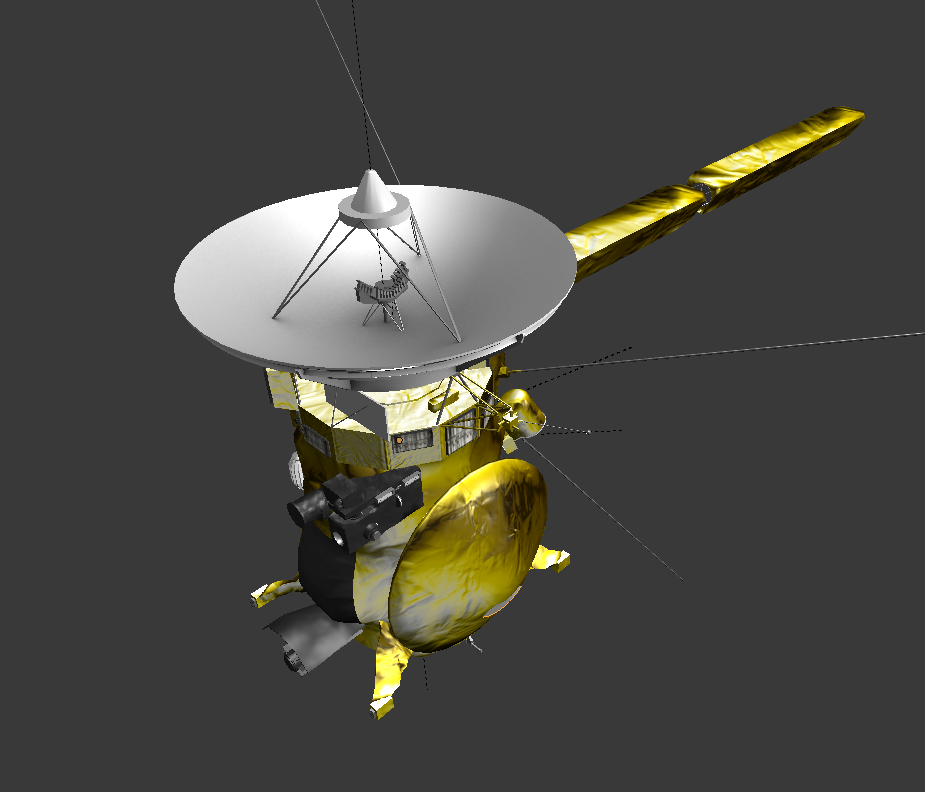

# [PovRay](http://www.povray.org/) model of Cassini
This script render a synthetic image of Cassini spacecraft.

## [NASA JPL Cassini 3D model](https://nasa3d.arc.nasa.gov/detail/jpl-vtad-cassini)
Screenshot of Cassini 3D model in [Blender](https://www.blender.org/) 


## Convert STL files to PovRay
### Install [STL tools](https://github.com/rsmith-nl/stltools.git) for `python`
```bash
git clone https://github.com/rsmith-nl/stltools.git
cd stltools
python setup.py install
```

### Install add-on for `Blender` to export selected part
```bash
git clone https://github.com/dairin0d/export-selected.git
```
Extract part by part.

### Convert `.stl` to `.inc`
```bash
python stltools/stl2pov.py -2 Blender/Cassini_<PART>.stl
```
Parts are saved in `src/Cassini` folder

## Render in PovRay
`Cassini.inc` and `Hyugens.inc` can be called in Povray from `src`.
```pov
#include "src/Cassini.inc"
object{ Cassini }
```
### Cassini alone


### Cassini and Huygens


**Other resources:**
- [JPL models](http://space.jpl.nasa.gov/models/)
- [Björn Jónsson](http://bjj.mmedia.is/povstuff/spacecraft/)